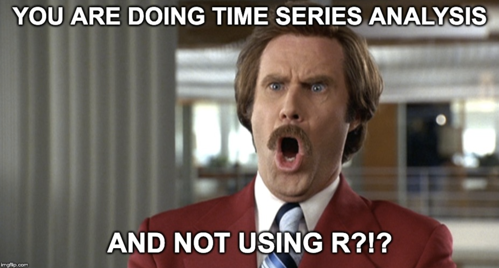
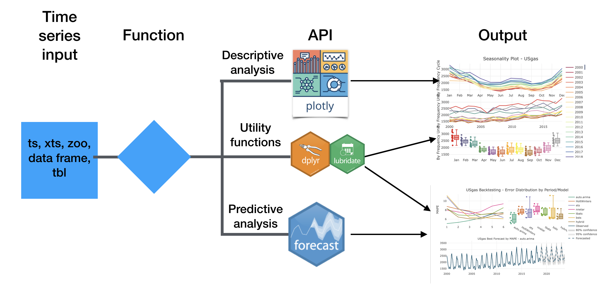

<style type="text/css">

body{ /* Normal  */
      font-size: 20px;
  }
td {  /* Table  */
  font-size: 16px;
}
h1.title {
  font-size: 38px;
  color: Black;
}
h1 { /* Header 1 */
  font-size: 28px;
  color: Blue;
}
h2 { /* Header 2 */
    font-size: 30px;
  color: Blue;
}
h3 { /* Header 3 */
  font-size: 25px;
  font-family: "Times New Roman", Times, serif;
  color: DarkBlue;
}
code.r{ /* Code block */
    font-size: 16px;
}
pre { /* Code block - determines code spacing between lines */
    font-size: 14px;
}
</style>


```{r setup, include=FALSE}
knitr::opts_chunk$set(echo = TRUE, fig.width=9, fig.height=5, warning=FALSE, message=FALSE)
library(TSstudio)
library(UKgrid)
library(shiny)
```

## Agenda

* Introduction to time series analysis and forecasting
* Time series objects - introduction to the time series classes and their attributes
* Descriptive analysis of time series
* Linear regression-based forecasting models
* The ARIMA family of models

Today, we will mainly focus on methods for analyzing and forecasting regular time-series data with seasonality patterns

### Quick pool

* Used R?
* Feel comfortable with linear regression?
* Familiar with the forecast package?
* Used ggplot2 or plotly?


### Assumptions

* Some background in R
* Basic knowledge in probability
* Familiar with linear regression 

### Why R?

```{r echo=FALSE, out.width="650px"}

```


* Open source and free
* Statistical programming language
* A vast amount of [packages](https://cran.r-project.org/web/views/TimeSeries.html) for time series analysis
* The [forecast](http://pkg.robjhyndman.com/forecast/) package (and soon the [fable](https://fable.tidyverts.org/) package)

### Goals
By the end of this workshop, you probably won't become an expert in time series analysis and forecasting, but you will be able to:

* Explore time series data with some basic tools
* Use discriptive statistics for identifying seasonal and correlation patterns 
* Build basic forecasting model

### Admin

#### Workshop material

All today's slides, code, and rmarkdown files are available on [GitHub](https://github.com/RamiKrispin/Time-Series-Workshop)

Downloading the workshop material from the terminal:

```{bash, eval=FALSE}
git clone https://github.com/RamiKrispin/Time-Series-Workshop.git
```


Or lunch it from a docker container:

```{bash, eval=FALSE}

```


## Introduction to time series analysis

Time series analysis is commonly used in many fields of science, such as economics, finance, physics, engineering, and astronomy.  The usage of time series analysis to understand past events and to predict future ones did not start with the introduction of the stochastic process during the past century. Ancient civilizations such as the Greeks, Romans, or Mayans, researched and learned how to utilize cycled events such as weather and astronomy to predict future events. 


**Time series analysis** - is the art of extracting meaningful insights from time-series data to learn about past events and to predict future events. 

This process includes the following steps:

* **Data collection** - pulling the raw data from a database, API, flat files etc.
* **Data prep** - cleaning, reformating (dates, classes, etc.), aggregating
* **Descriptive analysis** - using statistical methods and data visualization tools to extract insights and learn about the series components and patterns
* **Predictive analysis** - leveraging the insights learned in the descriptive process and apply some predictive model 


Generally, in R this process will look like this:

```{r echo=FALSE, out.width="850px"}
knitr::include_graphics("images/Time Series Analysis Workflow.png")
```

Of course, there are more great packages that could be part of this process such as [zoo](http://zoo.r-forge.r-project.org/), [xts](https://github.com/joshuaulrich/xts), [bsts](https://cran.r-project.org/web/packages/bsts/index.html), [forecastHybird](https://gitlab.com/dashaub/forecastHybrid), [prophet](https://facebook.github.io/prophet/docs/quick_start.html#r-api), etc.

### The TSstudio package

The [TSstudio](https://github.com/RamiKrispin/TSstudio) package provides a set of functions for time series analysis. That includes interactive data visualization tools based on the [plotly](https://plot.ly/r/) package engine, supporting multiple time series objects such as `ts`, `xts`, and `zoo`. The following diagram demonstrates the workflow of the **TSstudio** package:


```{r echo=FALSE, out.width="850px"}

```


### Time series data

**Time series data** - is a sequence of values, each associate to a unique point in time that can divide to the following two groups:

* **Regular time series** - is a sequence of observations which were captured at equally spaced time intervals (e.g., every month, week, day, hour, etc.)
* **Irregular time series** - or unevenly spaced time series, is a sequence of observations which were not captured on equally spaced time intervals (for example rainy days, earthquakes, clinical trials, etc.)


**Note:** typically, the term time series data referred to regular time-series data. Therefore, if not stated otherwise, throughout the workshop the term time series (or series) refer to regular time-series data

### Examples of time series data

```{r  echo=FALSE, warning=FALSE, message=FALSE}
library(UKgrid)

data(UKgrid)
UKgrid <- extract_grid(type = "data.frame", start = as.Date("2018-01-01"), end = as.Date("2018-01-31"))
TSstudio::ts_plot(UKgrid, title = "The Demand for Electricity in the UK (Half-Hourly Intervals)", Ytitle = "MW", Xtitle = "Date")

library(TSstudio)


TSstudio::ts_plot(USgas, title = "US Monthly Natural Gas Consumption", Ytitle = "Billion Cubic Feet", Xtitle = "Date")
TSstudio::ts_plot(USVSales, title = "US Monthly Total Vehicle Sales", Ytitle = "Thousands of Units", Xtitle = "Date")


```


### Applications

With time series analysis, you can answer questions such as:

* How many vehicles, **approximately**, going to be sold in the US in the next 12 months?
* What will be the **estimated** demand for natural gas in the US in the next five years?
* **Generally**, what will be the demand for electricity in the UK during the next 24 hours?


## Time series objects

There are multiple classes in R for time-series data, the most common types are:

* The `ts` class for regular time-series data, and `mts` class for multiple time seires objects , the most common class for time series data
* The `xts` and `zoo` classes for both regular and irregular time series data, mainly popular in the financial field
* The `tsibble` class, a tidy format for time series data, support both regular and irregular time-series data

### The attribute of time series object

A typical time series object should have the following attributes:

* A vector or matrix objects with sequential observations
* Index or timestamp
* Frequency units
* Cycle units

Where the frequency of the series represents the units of the cycle. For example, for monthly series, the frequency units are the month of the year, and the cycle units are the years. Similarly, for daily series, the frequency units could be the day of the year, and the cycle units are also the years. 

The **stats** package provides a set of functions for handling and extracting information from a `ts` object. The `frequency` and `cycle` functions, as their names implay return the frequency and the cycle, respectivly, of the object. Let's load the `USgas` series from the `TSstudio` package  and apply those functions:

```{r}
library(TSstudio)
data(USgas)

class(USgas)
is.ts(USgas)
frequency(USgas)
cycle(USgas)
```

The `time` function returns the series index or timestamp:

```{r}
head(time(USgas))
```

The `deltat` function returns the length of series' time interval (which is equivalent to 1/frequency):

```{r}
deltat(USgas)
```

Similarly, the `start` and `end` functions return the starting and ending time of the series, respectively:

```{r}
start(USgas)
end(USgas)
```

Where the left number represents the cycle units, and the right side represents the frequency units of the series. The `tsp` function returns both the start and end of the series and its frequency:

```{r}
tsp(USgas)
```

Last but not least, the `ts_info` function from the **TSstudio** package returns a concise summary of the series:

```{r}
ts_info(USgas)
```


### Creating a ts object

The `ts` function allows to create a `ts` object from a single vector and a `mts` object from a multiple vectors (or matrix). By defining the start (or end) and frequency of the series, the function generate the object index. In the following example we will load the `US_indicators` dataset from the TSstudio package and convert it to a ts object. The `US_indicators` is a `data.frame` with the monthly vehicle sales and unemployment rate in the US since 1976:


```{r}
data(US_indicators)

head(US_indicators)
```


```{r}
mts_obj <- ts(data = US_indicators[, c("Vehicle Sales", "Unemployment Rate")], 
              start = c(1976, 1),
              frequency = 12)

ts_info(mts_obj)
```

### How to define the start and frequency arguments?

Series Type | Cycle Units | Frequency Units| Frequency| Example
------------|-------------|----------------|----------|---------
Quarterly | Years | Quarter of the year | 4 | `ts(x, start = c(2019, 2), frequency = 4)`
Monthly | Years | Month of the year | 12| `ts(x, start = c(2019, 1), frequency = 12)`
Weekly | Years | Week of the year | 52 | `ts(x, start = c(2019, 13), frequency = 52)`
Daily | Years | Day of the year | 365 | `ts(x, start = c(2019, 290), frequency = 365)`

  
What if you have more granular time series data such as half-hour, 15 or five minutes intervals?

Me when needed to work with daily time series using `ts` object:

```{r echo=FALSE, out.width="650px"}
knitr::include_graphics("http://giphygifs.s3.amazonaws.com/media/eIPM3j6YXHKXC/giphy.gif")
```

### The disadvantages of the ts object
 
The ts object was designed for work with monthly, quarterly, or yearly series that have only two-time components (e.g., year and month). Yet, more granular series (high frequency) may have more than two-time components. A common example is a daily series that has the following time attributes:

* Year
* Month
* Day of the year
* Day of the week

When going to the hourly or minute levels, this is even adding more components such as the hour, minute, etc.

The `zoo`, `xts` classes and now the `tsibble` class provide solution for this issue.  


### The tsibble class

"The **tsibble** package provides a data infrastructure for tidy temporal data with wrangling tools..." 

In other words, the `tsibble` object allows you to work with a data frame alike (i.e., `tbl` object) with a time awareness attribute. The key characteristics of this class:

* It has a date/time object as an index
* Using key to store multiple time series objects
* A `tbl` object - can apply any of the normal tools to reformat, clean or modify `tbl` object such as `dplyr` functions

The reaction of me and my colegues when the tsibble **package** was released:

```{r echo=FALSE, out.width="650px"}
knitr::include_graphics("https://media.giphy.com/media/Yb3d5B1zwuhCo/giphy.gif")
```


### Creating a tsibble object

```{r}
library(UKgrid)

data(UKgrid)

class(UKgrid)

head(UKgrid)
```
```{r}
library(dplyr)
library(tsibble)
data(UKgrid)
uk_grid <- UKgrid %>% 
  dplyr::select(time = TIMESTAMP, 
                net_demand = ND) %>%
  tsibble::as_tsibble(index = time)
  

head(uk_grid)

class(uk_grid)

index(uk_grid)

tsibble::interval(uk_grid)

```


## Descriptive analysis of time series

Like most common fields of statistics and machine learning, the goal of the descriptive analysis is to reveal meaningful insights about the series with the use of descriptive statistics and data visualization tools.

### Plotting time series object

The `plot` function or `plot.ts` functions are R built-in functions for plotting time series object:


```{r}
data("USVSales")

plot.ts(USVSales, 
        main = "US Monthly Total Vehicle Sales",
        ylab = "Thousands of units",
        xlab = "Date")
```

Alternatively, the `ts_plot` function from the **TSstudio** package provides an interactive visualization for time series object (`ts`, `xts`, `zoo`, `tsibble`, ets.). This function using the **plotly** package plotting engine:

```{r}
ts_plot(USVSales, 
        title = "US Monthly Total Vehicle Sales",
        Ytitle = "Thousands of units",
        Xtitle = "Date",
        slider = TRUE)
```

The main advantage of using interactive data visualization tools that it allows you to zoom in the data with a click of a button. This is super useful when working with data and in particular, with time-series data. 

The [dygraphs](https://rstudio.github.io/dygraphs/) package is another great tool for visualization time series data:

```{r}
library(dygraphs)

dygraph(USVSales, 
        main = "US Monthly Total Vehicle Sales",
        ylab = "Thousands of units",
        xlab = "Date") %>% 
  dyRangeSelector()
```


### The time series components

Time series data, typically, would have two types of patterns:

**Structural patterns:**

* **Trend** - define the general growth of the series and its rate (e.g., linear, exponential, etc.)
* **Cycle** - derived from the broad definition of a cycle in macroeconomics. A cycle can be described as a sequence of repeatable events over time, where the starting point of a cycle is at a local minimum of the series and the ending point is at the next one, and the ending point of one cycle is the starting point of the following cycle.
* **Seasonal** - define the variation of the series that related to the frequency units of the series 

**Nonstructural patterns**

The **irregular** component - which include any other patterns that are not captured by the trend, cycle, and seasonal components. For example structural changes, non-seasonal holidays effect, etc.

Together, the structural and non-structural patterns compounding the series, which can be formalized by the following expressions:

* $Y_t = T_t + C_t + S_t + I_t$, when the series has an additive structure, or

* $Y_t = T_t \times C_t \times S_t \times I_t$, when the series has a multiplicative structure


```{r}
ts_decompose(USgas)
```

### Decomposition of time series object


### Seasonal analysis

```{r}
ts_seasonal(USgas, type = "normal")
ts_seasonal(USgas, type = "cycle")
ts_seasonal(USgas, type = "box")
```

```{r}

USgas_decompose <- USgas - decompose(USgas)$trend
ts_seasonal(USgas_decompose, type = "all")
```


```{r}
ts_heatmap(USgas, color = "Reds")
```


```{r}
ts_heatmap(USVSales, color = "Reds")
```

```{r}
ts_surface(USgas)
```


```{r}
ts_polar(USgas)
```

### Correlation Analysis


```{r}
UKgrid_daily <- extract_grid(type = "ts", aggregate = "daily")

acf(UKgrid_daily)
pacf(UKgrid_daily)

ts_cor(UKgrid_daily, lag.max = 365 * 2)


ts_cor(UKgrid_daily, lag.max = 365 * 2, seasonal_lags = 7)
```

```{r}
ts_lags(USgas)
```

```{r}
ts_lags(USgas, lags = c(12, 24, 36))
```

## Forecasting with linear regression


```{r regression, echo=FALSE}

inputPanel(
  selectInput("select_series", label = "Select the Series:",
              choices = c("USgas", "USVSales", "AirPassengers"), selected = "USgas",
              width = "600px"),
  
  checkboxGroupInput(inputId = "features", label = "Select the Model Features", 
                choices = c("Trend", "Seasonal", "Polynomial", "Lags"), selected = "Trend"),
    sliderInput("reg_test", "Set the Testing Length:",
                  min = 1, max = 60,
                  value = 12),
        sliderInput("reg_h", "Set the Forecasting Horizon:",
                  min = 1, max = 60,
                  value = 60),
  
   sliderInput("reg_pol", "Set the Polynomial Level:",
                  min = 0, max = 3,
                  value = 2,
               step = 0.1)
  


)

# plotly::renderPlotly({
#   if(input$select_series == series_names[1]){
#     ts.obj <- us_app_ts
#     ts.df <- us_app
#     ts.fc <- us_app_fc
#   } else if(input$select_series == series_names[2]){
#     ts.obj <- ja_app_ts
#     ts.df <- ja_app
#     ts.fc <- ja_app_fc
#   } else if(input$select_series == series_names[3]){
#     ts.obj <- ja_sub_ts
#     ts.df <- ja_sub
#     #ts.fc <- ja_app_fc
#   } else if(input$select_series == series_names[4]){
#     ts.obj <- us_num_sub_ts
#     ts.df <- us_num_sub
#   }
#   train <- test <- train_df <- test_df <- NULL
#   ts_par <- TSstudio::ts_split(ts.obj = ts.obj, sample.out = input$reg_test)
#   train <- ts_par$train
#   test <- ts_par$test
#   
#   train_df <- ts.df[1:(nrow(ts.df) - input$reg_test), ]
#   test_df <- ts.df[(nrow(ts.df) - input$reg_test + 1):nrow(ts.df), ]
#   
#   
#   if(is.null(input$features)){
#     p <- TSstudio::ts_plot(ts.obj = ts.obj)
#   } else{
#   
#     f <- NULL
#   
#     if("Trend" %in% input$features){
#       f <- c(f, "trend")
#     }
#     
#      if("Seasonal" %in% input$features){
#       f <- c(f, "season")
#      }
#     
#      if("Polynomial" %in% input$features){
#       f <- c(f, paste("I(trend ^ ", input$reg_pol,")", sep = ""))
#      }
#     
#     if("Holidays" %in% input$features){
#       f <- c(f, "flag")
#       tslm_f <- paste("train ~", paste(f, collapse = "+"), sep = " ")
#       md <- forecast::tslm(as.formula(tslm_f), data = train_df)
#       fc <- forecast::forecast(md, h = input$reg_test, newdata = test_df$flag)
#     } else {
#       tslm_f <- paste("train ~ ", paste(f, collapse = "+"), sep = " ")
#        md <- forecast::tslm(as.formula(tslm_f))
#        fc <- forecast::forecast(md, h = input$reg_test)
#     }
#   
#     
#     if(input$reg_maYoY){
#       ma_md <- ma4w(train,  h = input$reg_test)
#       p <- TSstudio::test_forecast(ts.obj, forecast.obj = fc, test = test) %>% 
#         plotly::add_lines(x = time(ma_md), y = as.numeric(ma_md), name = "YoY 4W MA", line = list(color = "purple")) %>%
#         plotly::layout(legend = list(x = 0.1, y = 0.9))
#     } else{
#        p <- TSstudio::test_forecast(ts.obj, forecast.obj = fc, test = test) %>% 
#          plotly::layout(legend = list(x = 0.1, y = 0.9))
#        }
#     }
# 
# })
# 
# 
# 
# plotly::renderPlotly({
#   if(input$select_series == series_names[1]){
#     ts.obj <- us_app_ts
#     ts.df <- us_app
#     ts.fc <- us_app_fc
#   } else if(input$select_series == series_names[2]){
#     ts.obj <- ja_app_ts
#     ts.df <- ja_app
#     ts.fc <- ja_app_fc
#   } else if(input$select_series == series_names[3]){
#     ts.obj <- ja_sub_ts
#   } else if(input$select_series == series_names[4]){
#     ts.obj <- us_num_sub_ts
#   }
# 
#  if(is.null(input$features)){
#     p <- TSstudio::ts_plot(ts.obj = ts.obj)
#   } else{
#   
#     f <- NULL
#   
#     if("Trend" %in% input$features){
#       f <- c(f, "trend")
#     }
#     
#      if("Seasonal" %in% input$features){
#       f <- c(f, "season")
#      }
#     
#      if("Polynomial" %in% input$features){
#       f <- c(f, paste("I(trend ^ ", input$reg_pol,")", sep = ""))
#     }
#   
#     
#     if("Holidays" %in% input$features){
#       f <- c(f, "flag")
#       tslm_f <- paste("ts.obj ~", paste(f, collapse = "+"), sep = " ")
#       md <- forecast::tslm(as.formula(tslm_f), data = ts.df)
#       fc <- forecast::forecast(md, h = input$reg_h, newdata = ts.fc$flag[1:input$reg_h])
#     } else {
#       tslm_f <- paste("ts.obj ~ ", paste(f, collapse = "+"), sep = " ")
#        md <- forecast::tslm(as.formula(tslm_f))
#        fc <- forecast::forecast(md, h = input$reg_h)
#     }
#     
# 
#   }
#   
#   
#   if(input$reg_maYoY){
#       ma_md <- ma4w(ts.obj,  h = input$reg_h)
#      p <- TSstudio::plot_forecast(fc) %>% 
#         plotly::add_lines(x = time(ma_md), y = as.numeric(ma_md), name = "YoY 4W MA",
#                           line = list(color = "purple", dash = "dash")) %>%
#         plotly::layout(legend = list(x = 0.1, y = 0.9))
#     } else{
#        p <- TSstudio::plot_forecast(fc) %>%
#       plotly::layout(legend = list(x = 0.1, y = 0.9))
#        } 
#   
# })
```
