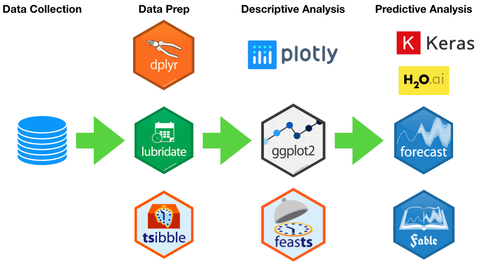

```{r setup, include=FALSE}
knitr::opts_chunk$set(echo = TRUE, fig.width=9, fig.height=5, warning=FALSE, message=FALSE)
```

## Agenda

* Introduction to time series analysis and forecasting
* Time series objects - introduction to the time series classes and their attributes
* Descriptive analysis of time series
* Linear regression-based forecasting models
* The ARIMA family of models

## Admin

All today's slides, code, and rmarkdown files are available [here](https://github.com/RamiKrispin/Time-Series-Workshop)

Downloading the workshop material from the terminal:

```{bash, eval=FALSE}
git clone https://github.com/RamiKrispin/Time-Series-Workshop.git
```


Or lunch it on a docker container:

```{bash, eval=FALSE}

```


## Introduction to time series analysis and forecasting

### Time series data

> **Time series data** - is a sequence of values, each associate to a unique point in time

> **Regular time series** - is a sequence of observations which were captured at equally spaced time intervals (e.g., every month, week, day, hour, etc.)

> **Irregular time series** - or unevenly spaced time series, is a sequence of observations which were not captured on equally spaced time intervals (for example rainy days, earthquakes, etc.)


**Note:** typically, the term time series data referred to regular time-series data.

### Examples of time series data

```{r echo = TRUE, echo=FALSE, warning=FALSE, message=FALSE}
library(UKgrid)

data(UKgrid)
UKgrid <- extract_grid(type = "data.frame", start = as.Date("2018-01-01"), end = as.Date("2018-01-31"))
TSstudio::ts_plot(UKgrid, title = "The Demand for Electricity in the UK (Half-Hourly Intervals)", Ytitle = "MW", Xtitle = "Date")

library(TSstudio)


TSstudio::ts_plot(USgas, title = "US Monthly Natural Gas Consumption", Ytitle = "Billion Cubic Feet", Xtitle = "Date")
TSstudio::ts_plot(USVSales, title = "US Monthly Total Vehicle Sales", Ytitle = "Thousands of Units", Xtitle = "Date")


```


### Time Series Analysis
> **Time series analysis** - is the process of extracting meaningful insights from time series data in order to learn about the past and predict the future


```{r echo=FALSE, out.width="850px"}

```