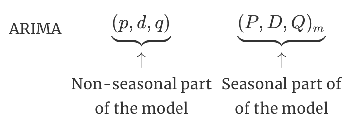

### Sources - ARIMA

- [Northwest Fisheries Science Center - Applied Time Series Analysis](https://nwfsc-timeseries.github.io)
  - [NWFSC - FISH 507, Lecture 2: ARMA Models by Mark Scheuerell ](https://github.com/nwfsc-timeseries/atsa/blob/master/Lectures/Week%202/lec_03_ARMA_models.Rmd)
  - [NWFSC - FISH 507, Lecture 3: Fitting and Selecting ARIMA models by Eli Holmes](https://github.com/nwfsc-timeseries/atsa/blob/master/Lectures/Week%202/lec_03_ARMA_models.Rmd)
- [Forecasting: Principles and Practice, 2nd Ed](https://otexts.com/fpp2/)
  - [FPP - Chapter 8.9: Seasonal ARIMA models by Rob Hyndman and George Athanasopoulos](https://otexts.com/fpp2/seasonal-arima.html)
  - [FPP - Chapter 9: Dynamic regression models by Rob Hyndman and George Athanasopoulos](https://otexts.com/fpp2/dynamic.html)


### Brief Overview

- White Noise and Random Walks
- Autoregressive (AR) models
- Moving average (MA) models
- Autoregressive moving average (ARMA) models
- Using ACF & PACF for model ID

### Goals

Leave this room with a shallow understanding of

- Stationarity
- Differencing
- ARMA Identification

| Model   | ACF               | PACF                    |
|:-------:|:-----------------:|:-----------------------:|
| AR(_p_) | Tails off slowly  | Cuts off after lag _p_  |
| MA(_q_) | Cuts off after lag _q_  | Tails off slowly  |
| ARMA(_p_,_q_) | Tails off slowly  | Tails off slowly  |

- ARIMA
- Seasonal ARIMA
- Linear Regression with ARIMA errors

---

#### Gaussian white noise

We often assume so-called _Gaussian white noise_, whereby

$$
w_t \sim \text{N}(0,\sigma^2)
$$

and the following apply as well

- autocovariance:
$$
\gamma_k =
    \begin{cases}
      \sigma^2 & \text{if } k = 0 \\
      0 & \text{if } k \geq 1
    \end{cases}
$$
- autocorrelation: 
$$
\rho_k =
    \begin{cases}
      1 & \text{if } k = 0 \\
      0 & \text{if } k \geq 1
    \end{cases}
$$

```{r ex_gaussian_wn, fig.cap=" ", fig.cap=" "}
par(mfrow = c(1,2), mai = c(0.6,0.5,0.3,0.1), oma = c(0,0,1.5,0), 
    mgp = c(1.7, .5, 0), cex.axis = .8, cex.axis = 0.8, tcl = -.3)
tt <- rnorm(100)
plot.ts(tt, ylab = expression(italic(w[t])))
acf(tt, main = "")
title(expression(w[t] %~% N(0,1)), outer = TRUE)
```

### Random walk (RW)

A time series $\{x_t\}$ is a random walk if

1. $x_t = x_{t-1} + w_t$
2. $w_t$ is white noise


```{r ex_rw, fig.cap=" "}
par(mfrow = c(1,2), mai = c(0.6,0.5,0.3,0.1), oma = c(0,0,1.5,0), 
    mgp = c(1.7, .5, 0), cex.axis = .8, cex.axis = 0.8, tcl = -.3)
tt <- cumsum(rnorm(100))
plot.ts(tt, ylab = expression(italic(x[t])))
acf(tt, main = "")
title(expression(list(x[t] == x[t-1] + w[t], w[t] %~% N(0,1))), outer = T)
```


#### Biased random walk

A _biased random walk_ (or _random walk with drift_) is written as

$$
x_t = x_{t-1} + u + w_t
$$  

where $u$ is the bias (drift) per time step and $w_t$ is white noise

```{r ex_biased_rw, fig.cap=" "}
par(mfrow = c(1,2), mai = c(0.6,0.5,0.3,0.1), oma = c(0,0,1.5,0), 
    mgp = c(1.7, .5, 0), cex.axis = .8, cex.axis = 0.8, tcl = -.3)
xx <- ww <- rnorm(100)
uu <- 1
for(t in 2:100) {
  xx[t] <- xx[t-1] + uu + ww[t]
}
plot.ts(xx, ylab = expression(italic(x[t])))
acf(tt, main = "")
title(expression(list(x[t] == x[t-1] + 1 + w[t], w[t] %~% N(0,1))), outer = T)
```


#### Differencing a biased random walk

First-differencing a biased random walk yields a constant mean (level) $u$ plus white noise

$$
\begin{align}
  x_t &= x_{t-1} + u + w_t \\
  x_t - x_{t-1} &= x_{t-1} - x_{t-1} + u + w_t \\
  x_t - x_{t-1} &= u + w_t \\
  \Delta x_t &= u + w_t
\end{align}
$$

```{r ex_diff_biased_rw, fig.cap=" "}
par(mfrow = c(1,2), mai = c(0.6,0.5,0.3,0.1), oma = c(0,0,1.5,0), 
    mgp = c(1.7, .5, 0), cex.axis = .8, cex.axis = 0.8, tcl = -.3)
plot.ts(diff(xx), ylab = expression(paste(Delta,italic(x[t]))))
acf(tt, main="")
title(expression(list(paste(Delta, x[t]) == 1 + w[t],w[t] %~% N(0,1))), outer = T, line = .7)
```


---


### Autoregressive (AR) models

Autoregressive models treat a current state of nature as a function its past state(s)

An _autoregressive_ model of order _p_, or AR(_p_), is defined as

$$
x_t = \phi_1 x_{t-1} + \phi_2 x_{t-2} + \dots + \phi_p x_{t-p} + w_t
$$

where we assume

1. $w_t$ is white noise
2. $\phi_p \neq 0$ for an order-_p_ process


#### Examples of AR(_p_) models

- AR(1)
  - $x_t = 0.5 x_{t-1} + w_t$
- AR(1) with $\phi_1 = 1$ (random walk)
  - $x_t = x_{t-1} + w_t$
- AR(2)
  - $x_t = -0.2 x_{t-1} + 0.4 x_{t-2} + w_t$


```{r, fig.cap=" "}
set.seed(123)
### the 4 AR coefficients
ARp <- c(0.7, 0.2, -0.1, -0.3)
### empty list for storing models
AR_mods <- vector("list", 4L)

par(mfrow = c(2,2), mai = c(0.6,0.5,0.3,0.1), oma = c(0,0,1.5,0), 
    mgp = c(1.7, .5, 0), cex.axis = .8, cex.axis = 0.8, tcl = -.3)
### loop over orders of p
for(p in 1:4) {
  ## assume SD=1, so not specified
  AR_mods[[p]] <- arima.sim(n=50, list(ar=ARp[1:p]))
  plot.ts(AR_mods[[p]], las = 1,
          ylab = expression(italic(x[t])))
  mtext(side = 3, paste0("AR(",p,")"),
        line = 0.3, adj = 0, cex = 0.8)
}
```

#### Stationary AR(_p_) models

> **Stationarity** means 'not changing in time' in the context of time-series models. More generally, if all statistical properties of a time-series are time-constant then a time series is 'stationary'.

Specifically, _stationary_ time series have the following properties

1. no systematic change in the mean or variance  
2. no systematic trend  
3. no periodic variations or seasonality

We seek a means for identifying whether our AR(_p_) models are also stationary

We can write out an AR(_p_) model using the backshift operator

$$
  x_t = \phi_1 x_{t-1} + \phi_2 x_{t-2} + \dots + \phi_p x_{t-p} + w_t \\
  \Downarrow \\
\begin{align}
  x_t - \phi_1 x_{t-1} - \phi_2 x_{t-2} - \dots - \phi_p x_{t-p} &= w_t \\
  (1 - \phi_1 \mathbf{B} - \phi_2 \mathbf{B}^2 - \dots - \phi_p \mathbf{B}^p) x_t &= w_t \\
  \phi_p (\mathbf{B}) x_t &= w_t \\
\end{align}
$$

If we treat $\mathbf{B}$ as a number (or numbers), we can out write the _characteristic equation_ as

$$
\phi_p (\mathbf{B}) x_t = w_t \\
\Downarrow \\
\phi_p (\mathbf{B}) = 0
$$

To be stationary, __all roots__ of the characteristic equation __must exceed 1 in absolute value__

#### Example: Consider the AR(1) model from earlier

$$
\begin{align}
  x_t &= 0.5 x_{t-1} + w_t \\
  x_t - 0.5 x_{t-1} &= w_t \\
  (1 - 0.5 \mathbf{B})x_t &= w_t \\
  \Downarrow \\
  1 - 0.5 \mathbf{B} &= 0 \\
  -0.5 \mathbf{B} &= -1 \\
  \mathbf{B} &= 2 \\
\end{align}
$$

This model is stationary because $\mathbf{B} > 1$

#### What about this AR(2) model from earlier?

$$
\begin{align}
  x_t &= -0.2 x_{t-1} + 0.4 x_{t-2} + w_t \\
  x_t + 0.2 x_{t-1} - 0.4 x_{t-2} &= w_t \\
  (1 + 0.2 \mathbf{B} - 0.4 \mathbf{B}^2)x_t &= w_t \\
  \Downarrow \\
  1 + 0.2 \mathbf{B} - 0.4 \mathbf{B}^2 &= 0 \\
  \Downarrow \\
  \mathbf{B} \approx -1.35 ~ \text{and}& ~ \mathbf{B} \approx 1.85
\end{align}
$$

This model is _not_ stationary because only one $\mathbf{B} > 1$


#### What about random walks?

Consider our random walk model

$$
\begin{align}
  x_t &= x_{t-1} + w_t \\
  x_t - x_{t-1} &= w_t \\
  (1 - 1 \mathbf{B})x_t &= w_t \\
  \Downarrow \\
  1 - 1 \mathbf{B} &= 0 \\
  -1 \mathbf{B} &= -1 \\
  \mathbf{B} &= 1 \\
\end{align}
$$

Random walks are __not__ stationary because $\mathbf{B} = 1 \ngtr 1$


### Coefficients of AR(1) models

#### Same value, but different sign

```{r ar_comp_pos_neg, fig.height=4, fig.cap=" "}
set.seed(123)
### list description for AR(1) model with small coef
AR_pos <- list(order=c(1,0,0), ar=0.7, sd=0.1)
### list description for AR(1) model with large coef
AR_neg <- list(order=c(1,0,0), ar=-0.7, sd=0.1)
### simulate AR(1)
AR1_pos <- arima.sim(n=500, model=AR_pos)
AR1_neg <- arima.sim(n=500, model=AR_neg)

### get y-limits for common plots
ylm1 <- c(min(AR1_pos[1:50],AR1_neg[1:50]), max(AR1_pos[1:50],AR1_neg[1:50]))

### set the margins & text size
par(mfrow = c(1,2), mai = c(.6,0.6,0.1,0.2), oma = c(0,0,1.5,0), 
    mgp = c(1.7,.6,0))
### plot the ts
plot.ts(AR1_pos[1:50], ylim=ylm1, las = 1,
        ylab=expression(italic(x)[italic(t)]))
mtext(side = 3, expression(paste(phi[1]," = 0.7")),
      line = 0.4, adj = 0, cex = 0.8)
plot.ts(AR1_neg[1:50], ylim=ylm1, las = 1,
        ylab=expression(italic(x)[italic(t)]))
mtext(side = 3, expression(paste(phi[1]," = -0.7")),
      line = 0.4, adj = 0, cex = 0.8)
```

#### Both positive, but different magnitude

```{r ar_comp_sm_big, fig.height=4, fig.cap=" "}
set.seed(123)
### list description for AR(1) model with small coef
AR_bg <- list(order=c(1,0,0), ar=0.9, sd=0.1)
### list description for AR(1) model with large coef
AR_sm <- list(order=c(1,0,0), ar=0.1, sd=0.1)
### simulate AR(1)
AR1_bg <- arima.sim(n=500, model=AR_bg)
AR1_sm <- arima.sim(n=500, model=AR_sm)

### get y-limits for common plots
ylm2 <- c(min(AR1_bg[1:50],AR1_sm[1:50]), max(AR1_bg[1:50],AR1_sm[1:50]))

### set the margins & text size
par(mfrow = c(1,2), mai = c(.6,0.6,0.1,0.2), oma = c(0,0,1.5,0), 
    mgp = c(1.7,.6,0))
### plot the ts
plot.ts(AR1_bg[1:50], ylim = ylm2, las = 1,
        ylab = expression(italic(x)[italic(t)]),
        main = "")
mtext(side = 3, expression(paste(phi[1]," = 0.9")),
      line = 0.4, adj = 0, cex = 0.8)
plot.ts(AR1_sm[1:50], ylim = ylm2, las = 1,
        ylab = expression(italic(x)[italic(t)]),
        main = "")
mtext(side = 3, expression(paste(phi[1]," = 0.1")),
      line = 0.4, adj = 0, cex = 0.8)
```

---

### ACF & PACF for AR(_p_) models

#### Autocorrelation function (ACF)

Recall that the _autocorrelation function_ ($\rho_k$) measures the correlation between $\{x_t\}$ and a shifted version of itself $\{x_{t+k}\}$ 


#### ACF for AR(1) models

##### ACF oscillates for model with $-\phi$

```{r, fig.cap=" "}
### set the margins & text size
par(mfrow=c(2,2), mai = c(0.6,0.5,0.3,0.1), oma = c(0,0,1.5,0), 
    mgp = c(1.7, .5, 0), cex.axis = .8, cex.axis = 0.8, tcl = -.3)
### plot the ts
plot.ts(AR1_pos[1:50], ylim=ylm1, las = 1,
        ylab=expression(italic(x)[italic(t)]),
        main = "")
mtext(side = 3, expression(paste(phi[1]," = 0.7")),
      line = 0.2, adj = 0, cex = 0.8)
acf(AR1_pos, lag.max = 20, las = 1)
plot.ts(AR1_neg[1:50], ylim=ylm1, las = 1,
        ylab=expression(italic(x)[italic(t)]),
        main = "")
mtext(side = 3, expression(paste(phi[1]," = -0.7")),
      line = 0.2, adj = 0, cex = 0.8)
acf(AR1_neg, lag.max = 20, las = 1)
```

#### For model with large $\phi$, ACF has longer tail

```{r, fig.cap=" "}
### set the margins & text size
par(mfrow=c(2,2), mai = c(0.6,0.5,0.3,0.1), oma = c(0,0,1.5,0), 
    mgp = c(1.7, .5, 0), cex.axis = .8, cex.axis = 0.8, tcl = -.3)
### plot the ts
plot.ts(AR1_bg[1:50], ylim = ylm2, las = 1,
        ylab = expression(italic(x)[italic(t)]),
        main = "")
mtext(side = 3, expression(paste(phi[1]," = 0.9")),
      line = 0.2, adj = 0, cex = 0.8)
acf(AR1_bg, lag.max = 20, las = 1)
plot.ts(AR1_sm[1:50], ylim = ylm2, las = 1,
        ylab = expression(italic(x)[italic(t)]),
        main = "")
mtext(side = 3, expression(paste(phi[1]," = 0.1")),
      line = 0.2, adj = 0, cex = 0.8)
acf(AR1_sm, lag.max = 20, las = 1)
```


#### Partial autocorrelation funcion (PACF)

Recall that the _partial autocorrelation function_ ($\phi_k$) measures the correlation between $\{x_t\}$ and a shifted version of itself $\{x_{t+k}\}$, with the linear dependence of $\{x_{t-1},x_{t-2},\dots,x_{t-k-1}\}$ removed

```{r, fig.cap=" "}
### set 3 AR coefficients
ARp3 <- list(c(0.7, 0.2, -0.1), c(-0.7, 0.2, 0.1))

expr <- list(expression(paste("AR(3) with ", phi[1], " = 0.7, ",
                              phi[2], " = 0.2, ", phi[3], " = -0.1")),
             expression(paste("AR(3) with ", phi[1], " = -0.7, ",
                              phi[2], " = 0.2, ", phi[3], " = 0.1")))

### empty list for storing models
AR3_mods <- vector("list", 2L)

par(mfrow = c(2,3), mai = c(0.5,0.4,0.3,0.1), oma = c(0,0,1.5,0), 
    mgp = c(1.8, .7, 0), cex.axis = 0.8, tcl = -.3)
### loop over orders of p
for(p in 1:2) {
  ## assume SD=1, so not specified
  AR3_mods[[p]] <- arima.sim(n=5000, list(ar=ARp3[[p]]))
  plot.ts(AR3_mods[[p]][1:50], las = 1,
          ylab = expression(italic(x[t])))
  acf(AR3_mods[[p]], lag.max = 20,
      las = 1, main = "")
  mtext(side = 3, expr[[p]],
        line = 0.2, adj = 0.5, cex = .8)
  pacf(AR3_mods[[p]], lag.max = 20,
       las = 1, main = "")
}
```


#### PACF for AR(_p_) models

```{r, fig.cap=" "}
### empty list for storing models
pacf_mods <- vector("list", 4L)

par(mfrow = c(2,2), mai = c(0.6,0.5,0.3,0.1), oma = c(0,0,1.5,0), 
    mgp = c(1.7, .5, 0), cex.axis = .8, cex.axis = 0.8, tcl = -.3)
### loop over orders of p
for(p in 1:4) {
  pacf_mods[[p]] <- arima.sim(n=5000, list(ar=ARp[1:p]))
  pacf(pacf_mods[[p]], lag.max = 15,
       las = 1, main = "")
  mtext(side = 3, paste0("AR(",p,")"),
        line = 0.2, adj = 0)
}

```

> Do you see the link between the order _p_ and lag _k_?


#### Using ACF & PACF for model ID (1)

| Model   | ACF               | PACF                    |
|:-------:|:-----------------:|:-----------------------:|
| AR(_p_) | Tails off slowly  | Cuts off after lag _p_  |

---

### Moving average (MA) models


Moving average models are most commonly used for forecasting a future state


A moving average model of order _q_, or MA(_q_), is defined as

$$
x_t = w_t + \theta_1 w_{t-1} + \theta_2 w_{t-2} + \dots + \theta_q w_{t-q}
$$

where $w_t$ is white noise

Each of the $x_t$ is a sum of the most recent error terms


A moving average model of order _q_, or MA(_q_), is defined as

$$
x_t = w_t + \theta_1 w_{t-1} + \theta_2 w_{t-2} + \dots + \theta_q w_{t-q}
$$

where $w_t$ is white noise

Each of the $x_t$ is a sum of the most recent error terms

Thus, _all_ MA processes are stationary because they are finite sums of stationary WN processes

##### Examples of MA(_q_) models

```{r, fig.cap=" "}
### the 4 MA coefficients
MAq <- c(0.7, 0.2, -0.1, -0.3)
### empty list for storing models
MA_mods <- vector("list", 4L)
### loop over orders of q
for(q in 1:4) {
  ## assume SD=1, so not specified
  MA_mods[[q]] <- arima.sim(n=500, list(ma=MAq[1:q]))
}

par(mfrow = c(2,2), mai = c(0.6,0.5,0.3,0.1), oma = c(0,0,1.5,0), 
    mgp = c(1.7, .5, 0), cex.axis = .8, cex.axis = 0.8, tcl = -.3)
### loop over orders of p
for(q in 1:4) {
  ## assume SD=1, so not specified
  plot.ts(MA_mods[[q]][1:50], las = 1,
          ylab = expression(italic(x[t])))
  mtext(side = 3, paste0("MA(",q,")"),
        line = 0.2, adj = 0, cex = 0.8)
}

```


##### Compare MA(1) & MA(2) with similar structure

```{r, fig.cap=" "}
MA1 <- arima.sim(n=50, list(ma=c(0.7)))
MA2 <- arima.sim(n=50, list(ma=c(-1, 0.7)))

par(mfrow = c(1,2), mai = c(0.6,0.5,0.3,0.1), oma = c(0,0,1.5,0), 
    mgp = c(1.7, .5, 0), cex.axis = .8, cex.axis = 0.8, tcl = -.3)
### loop over orders of p
plot.ts(MA1, las = 1,
        ylab = expression(italic(x[t])))
mtext(side = 3,
      expression(MA(1):~italic(x[t])==~italic(w[t])+0.7~italic(w[t-1])),
      line = 0.2, adj = 0, cex = 0.8)
plot.ts(MA2, las = 1,
        ylab = expression(italic(x[t])))
mtext(side = 3,
      expression(MA(2):~italic(x[t])==~italic(w[t])-~italic(w[t-1])+0.7~italic(w[t-2])),
      line = 0.2, adj = 0, cex = 0.8)

```


---


### AR(_p_) model as an MA($\infty$) model

It is possible to write an AR(_p_) model as an MA($\infty$) model

For example, consider an AR(1) model

$$
\begin{align}
x_t &= \phi x_{t-1} + w_t \\
x_t &= \phi (\phi x_{t-2} + w_{t-1}) + w_t \\
x_t &= \phi^2 x_{t-2} + \phi w_{t-1} + w_t \\
x_t &= \phi^3 x_{t-3} + \phi^2 w_{t-2} + \phi w_{t-1} + w_t \\
& \Downarrow \\
x_t &= w_t + \phi w_{t-1}+ \phi^2 w_{t-2} + \dots + \phi^k w_{t-k} + \phi^{k+1} x_{t-k-1}
\end{align}
$$

If our AR(1) model is stationary, then

$$
\lvert \phi \rvert < 1 ~ \Rightarrow ~ \lim_{k \to \infty} \phi^{k+1} = 0
$$

so

$$
\begin{align}
  x_t &= w_t + \phi w_{t-1}+ \phi^2 w_{t-2} + \dots + \phi^k w_{t-k} + \phi^{k+1} x_{t-k-1} \\
  & \Downarrow \\
  x_t &= w_t + \phi w_{t-1}+ \phi^2 w_{t-2} + \dots + \phi^k w_{t-k}
\end{align}
$$
$$
$$


### Invertible MA(_q_) models

An MA(_q_) process is invertible if it can be written as a _stationary autoregressive process of infinite order without an error term_

For example, consider an MA(1) model

$$
\begin{align}
  x_t &= w_t + \theta w_{t-1} \\
  & \Downarrow \\
  w_t &= x_t - \theta w_{t-1} \\
  w_t &= x_t - \theta (x_{t-1} - \theta w_{t-2}) \\
  w_t &= x_t - \theta x_{t-1} - \theta^2 w_{t-2} \\
  & ~~\vdots \\
  w_t &= x_t - \theta x_{t-1} + \dots + (-\theta)^k x_{t-k}  + (-\theta)^{k+1} w_{t-k-1} \\
\end{align}
$$

If we constrain $\lvert \theta \rvert < 1$, then

$$
\lim_{k \to \infty} (-\theta)^{k+1} w_{t-k-1} = 0
$$

and

$$
\begin{align}
  w_t &= x_t - \theta x_{t-1} + \dots + (-\theta)^k x_{t-k}  + (-\theta)^{k+1} w_{t-k-1} \\
  & \Downarrow \\
  w_t &= x_t - \theta x_{t-1} + \dots + (-\theta)^k x_{t-k} \\
  w_t &= x_t + \sum_{k=1}^\infty(-\theta)^k x_{t-k}
\end{align}
$$


> Q: Why do we care if an MA(_q_) model is invertible?

> A: It helps us identify the model's parameters

##### Example, these MA(1) models are equivalent

- $x_t = w_t + \frac{1}{5} w_{t-1}, ~\text{with} ~w_t \sim ~\text{N}(0,25)$
- $x_t = w_t + 5 w_{t-1}, ~\text{with} ~w_t \sim ~\text{N}(0,1)$

But we select the first model because it is invertable (the coefficient is less than 1).


### ACF & PACF for MA(_q_) models

```{r, fig.cap=" "}
### set 3 AR coefficients
set.seed(123)
MAp3 <- list(c(0.7), c(-0.7, 0.5, 0.2))

expr <- list(expression(paste("MA(1) with ", theta[1], " = 0.7, ")),
             expression(paste("MA(3) with ", theta[1], " = -0.7, ",
                              theta[2], " = 0.5, ", theta[3], " = 0.2")))

### empty list for storing models
MA3_mods <- vector("list", 2L)

par(mfrow = c(2,3), mai = c(0.6,0.5,0.3,0.1), oma = c(0,0,1.5,0), 
    mgp = c(1.7, .5, 0), cex.axis = .8, cex.axis = 0.8, tcl = -.3)
### loop over orders of p
for(p in 1:2) {
  ## assume SD=1, so not specified
  MA3_mods[[p]] <- arima.sim(n=500, model = list(ma=MAp3[[p]]))
  plot.ts(MA3_mods[[p]][1:50], las = 1,
          ylab = expression(italic(x[t])))
  acf(MA3_mods[[p]], lag.max = 10,
      las = 1, main = "")
  mtext(side = 3, expr[[p]],
        line = 0.2, adj = 0.5, cex = .8)
  pacf(MA3_mods[[p]], lag.max = 10,
       las = 1, main = "")
}
```


#### ACF for MA(_q_) models

```{r, fig.cap=" "}
### the 4 MA coefficients
set.seed(123)
MAq <- c(0.7, 0.5, -0.2, -0.3)

### empty list for storing models
acf_mods <- vector("list", 4L)

par(mfrow = c(2,2), mai = c(0.6,0.5,0.3,0.1), oma = c(0,0,1.5,0), 
    mgp = c(1.7, .5, 0), cex.axis = .8, cex.axis = 0.8, tcl = -.3)
### loop over orders of p
for(q in 1:4) {
  acf_mods[[p]] <- arima.sim(n=5000, list(ma=MAq[1:q]))
  acf(acf_mods[[p]], lag.max = 15,
       las = 1, main = "")
  mtext(side = 3, paste0("MA(",q,")"),
        line = 0.2, adj = 0, cex = .8)
}
```

> Do you see the link between the order _q_ and lag _k_?


#### Using ACF & PACF for model ID (2)

| Model   | ACF               | PACF                    |
|:-------:|:-----------------:|:-----------------------:|
| AR(_p_) | Tails off slowly  | Cuts off after lag _p_  |
| MA(_q_) | Cuts off after lag _q_  | Tails off slowly  |

---

### Autoregressive moving average models (ARMA)

An autoregressive moving average, or ARMA(_p_,_q_), model is written as

$$
x_t = \phi_1 x_{t-1} + \dots + \phi_p x_{t-p} + w_t + \theta_1 w_{t-1} + \dots + \theta_q w_{t-q} 
$$


We can write an ARMA(_p_,_q_) model using the backshift operator

$$
\phi_p (\mathbf{B}) x_t=  \theta_q (\mathbf{B}) w_t 
$$

ARMA models are _stationary_ if all roots of $\phi_p (\mathbf{B}) > 1$

ARMA models are _invertible_ if all roots of $\theta_q (\mathbf{B}) > 1$


#### Examples of ARMA(_p_,_q_) models

```{r, fig.cap=" "}
set.seed(123)
arma_mods <- vector("list", 4L)

### ARMA(3,1): phi[1] = 0.7, phi[2] = 0.2, phi[3] = -0.1, theta[1]= 0.5
arma_mods[[1]] <- arima.sim(list(ar=c(0.7, 0.2, -0.1), ma=c(0.5)), n=5000)
### ARMA(2,2): phi[1] = -0.7, phi[2] = 0.2, theta[1] = 0.7, theta[2]= 0.2
arma_mods[[2]] <- arima.sim(list(ar=c(-0.7, 0.2), ma=c(0.7, 0.2)), n=5000)
### ARMA(1,3): phi[1] = 0.7, theta[1] = 0.7, theta[2]= 0.2, theta[3] = 0.5
arma_mods[[3]] <- arima.sim(list(ar=c(0.7), ma=c(0.7, 0.2, 0.5)), n=5000)
### ARMA(2,2): phi[1] = 0.7, phi[2] = 0.2, theta[1] = 0.7, theta[2]= 0.2
arma_mods[[4]] <- arima.sim(list(ar=c(0.7, 0.2), ma=c(0.7, 0.2)), n=5000)

titles <- list(
  expression("ARMA(3,1): "*phi[1]*" = 0.7, "*phi[2]*" = 0.2, "*phi[3]*" = -0.1, "*theta[1]*" = 0.5"),
  expression("ARMA(2,2): "*phi[1]*" = -0.7, "*phi[2]*" = 0.2, "*theta[1]*" = 0.7, "*theta[2]*" = 0.2"),
  expression("ARMA(1,3): "*phi[1]*" = 0.7, "*theta[1]*" = 0.7, "*theta[2]*" = 0.2, "*theta[3]*" = 0.5"),
  expression("ARMA(2,2): "*phi[1]*" = 0.7, "*phi[2]*" = 0.2, "*theta[1]*" = 0.7, "*theta[2]*" = 0.2")
)

par(mfrow = c(2,2), mai = c(0.6,0.5,0.3,0.1), oma = c(0,0,1.5,0), 
    mgp = c(1.7, .5, 0), cex.axis = .8, cex.axis = 0.8, tcl = -.3)
### loop over orders of p
for(i in 1:4) {
  plot.ts(arma_mods[[i]][1:50], las = 1,
          main = "", ylab = expression(italic(x[t])))
  mtext(side = 3, titles[[i]],
        line = 0.2, adj = 0, cex = 0.7)
  
}
```


#### ACF for ARMA(_p_,_q_) models

```{r, fig.cap=" "}
par(mfrow = c(2,2), mai = c(0.6,0.5,0.3,0.1), oma = c(0,0,1.5,0), 
    mgp = c(1.7, .5, 0), cex.axis = .8, cex.axis = 0.8, tcl = -.3)
### loop over orders of p
for(i in 1:4) {
  acf(arma_mods[[i]][1:1000], las = 1,
          main = " ")
  mtext(side = 3, titles[[i]],
        line = 0.2, adj = 0, cex = 0.8)
  
}
```


#### PACF for ARMA(_p_,_q_) models

```{r, fig.cap=" "}
par(mfrow = c(2,2), mai = c(0.6,0.5,0.3,0.1), oma = c(0,0,1.5,0), 
    mgp = c(1.7, .5, 0), cex.axis = .8, cex.axis = 0.8, tcl = -.3)
### loop over orders of p
for(i in 1:4) {
  pacf(arma_mods[[i]][1:1000], las = 1,
          main = "")
  mtext(side = 3, titles[[i]],
        line = 0.2, adj = 0, cex = 0.8)
  
}
```


#### Using ACF & PACF for model ID (3)

| Model   | ACF               | PACF                    |
|:-------:|:-----------------:|:-----------------------:|
| AR(_p_) | Tails off slowly  | Cuts off after lag _p_  |
| MA(_q_) | Cuts off after lag _q_  | Tails off slowly  |
| ARMA(_p_,_q_) | Tails off slowly  | Tails off slowly  |

---

### Autoregressive integrated moving average (ARIMA) models

If the data do not appear stationary, differencing can help

This leads to the class of _autoregressive integrated moving average_ (ARIMA) models

ARIMA models are indexed with orders (_p_,_d_,_q_) where _d_ indicates the order of differencing


#### ARIMA(_p_,_d_,_q_) models

For $d > 0$, $\{x_t\}$ is an ARIMA(_p_,_d_,_q_) process if $(1-\mathbf{B})^d x_t$ is an ARMA(_p_,_q_) process

For example, if $\{x_t\}$ is an ARIMA(1,1,0) process then $\Delta \{x_t\}$ is an ARMA(1,0) = AR(1) process


```{r, fig.cap=" "}
set.seed(123)

xx <- arima.sim(model=list(ar=0.5, sd=0.1), n=100)
yy <- cumsum(xx)

par(mfrow = c(2,3), mai = c(0.6,0.5,0.3,0.1), oma = c(0,0,1.5,0), 
    mgp = c(1.6, .5, 0), cex.axis = .8, cex.axis = 0.8, tcl = -.3)
plot.ts(yy, las = 1,
        ylab=expression(italic(x[t])))
mtext(side = 3, "ARIMA(1,1,0)", line = 0.2, adj = 0, cex = 0.8)
acf(yy, main = "")
pacf(yy, main = "")

plot.ts(diff(yy), las = 1,
        ylab=expression(paste(symbol("\xd1"), italic(x[t]))))
mtext(side = 3, "ARMA(1,0)", line = 0.2, adj = 0, cex = 0.8)
acf(diff(yy), main = "")
pacf(diff(yy), main = "")
```

---

### Automating the Box-Jenkins method

#### Box-Jenkins Method

- Model form selection
  - Evaluate stationarity
  - Selection of the differencing level (d) -- to fix stationarity problems
  - Selection of the AR level (p)
  - Selection of the MA level (q)
- Parameter estimation
- Model checking

Fortunately, the Box-Jenkins method is automated with the **forecast** package function `forecast::auto.arima`.

#### `forecast::auto.arima`

Let's look at some examples of `auto.arima` in action using simulated data.

```{r}

set.seed(1789)
nsims=50
# ARIMA(1,0,1)
xx <- arima.sim(model=list(ar = 0.5, ma = .3, sd=0.1), n=nsims)
# ARIMA(1,1,1)
yy <- ts(cumsum(xx))

par(mfrow = c(1,2), mai = c(0.6,0.5,0.3,0.1), oma = c(0,0,1.5,0), 
    mgp = c(1.6, .5, 0), cex.axis = .8, cex.axis = 0.8, tcl = -.3)
plot.ts(xx, las = 1,
        ylab=expression(italic(x[t])))
plot.ts(yy, las = 1,
        ylab=expression(italic(y[t])))

# estimate when knowing the order
stats::arima(xx, order = c(1,0,1), include.mean = F)
stats::arima(yy, order = c(1,1,1), include.mean = F)

# estimate with forecast::auto.arima
## finds ARMA(1,1) with similar parameter estimates
forecast::auto.arima(xx)
forecast::auto.arima(yy)

```

But `auto.arima` isn't a cure-all. Let's try a different simulation with a more complicated model. We'll see that `auto.arima`, like any automated procedure, should be used with caution.

```{r}

set.seed(1789)
N=50
# ARIMA(2,0,2)
xx <- arima.sim(model=list(ar = c(0.5, 0.2), ma = c(.3, -.2), sd=0.2), n=N)
# ARIMA(2,1,2)
yy <- ts(cumsum(xx))

par(mfrow = c(1,2), mai = c(0.6,0.5,0.3,0.1), oma = c(0,0,1.5,0), 
    mgp = c(1.6, .5, 0), cex.axis = .8, cex.axis = 0.8, tcl = -.3)
plot.ts(xx, las = 1,
        ylab=expression(italic(x[t])))
plot.ts(yy, las = 1,
        ylab=expression(italic(y[t])))

# estimate when knowing the order
## pretty good estimates
stats::arima(xx, order = c(2,0,2), include.mean = F)
stats::arima(yy, order = c(2,1,2), include.mean = F)

# estimate with forecast::auto.arima
forecast::auto.arima(xx) # FAILS. finds ARIMA(0,1,0)
forecast::auto.arima(yy) # FAILS. finds ARIMA(0,2,0)

```

Of course, this is simulated data. To be fair to `auto.arima`, I should run multiple distince simulations and see how often the `auto.arima` function correctly gets the model order and how well it estimates the model coefficients.

However, keep in mind, when it comes to working with real time series data *one only gets to observe a single realized state of the world*. Tread carefully.

---

### Seasonal ARIMA (SARIMA)

```{r, fig.cap="Source: https://otexts.com/fpp2/seasonal-arima.html", echo = FALSE}

```

where $m$ is the number of observations per year.


```{r}
library(forecast)
library(fpp2)

fpp2::euretail
```

Recall that seasonality violates stationarity. Let's first try to remove the seasonality by taking the first seasonal difference ($m=4$ so the seasonal diff is on the 4th lag).

```{r}
euretail %>%
  diff(lag=4) %>% 
  forecast::ggtsdisplay()
```

Still non-stationary. Let's also take the first difference

```{r}
euretail %>%
  diff(lag=4) %>%
  diff(lag=1) %>% 
  forecast::ggtsdisplay()
```

#### `auto.arima` with Seasonal data

```{r}

fit <- euretail %>%
  forecast::auto.arima() # assumes seasonal by default and runs tests
fit # finds an ARIMA(0,1,3)(0,1,1)[4] fits best
forecast::checkresiduals(fit) # pretty baller fit

# plot forecast
fit %>%
  forecast::forecast(h=12) %>%
  forecast::autoplot()
```

---

### Dynamic Linear Regression (Linear Models with ARIMA errors)

```{r}
library(fpp2)

forecast::autoplot(uschange[,1:2], facets=TRUE) +
  ggplot2::xlab("Year") + 
  ggplot2::ylab("") +
  ggplot2::ggtitle("Quarterly changes in US consumption and personal income")

```

```{r}
trn <- head(uschange, -20) # exclude last 20 quarters
tst <- tail(uschange, 20) # keep training set
fit <- forecast::auto.arima(
  trn[,"Consumption"],
  xreg = trn[,"Income"]) # pass a vector of regressions
fit # model y[t] = b0 + b1*x[t] + e[t], e[t] ~ ARIMA(1,0,2)

# pass the held out income data from the test set
fit %>%
  forecast::forecast(h = nrow(tst), xreg = tst[,"Income"]) %>%
  forecast::autoplot() +
  forecast::autolayer(tst[,"Consumption"], series = 'actuals')

```

The problem is that to forecast beyond observed data requires forecasting the regressors `xreg`. 

```{r}
# use full data set
fit_consump <- forecast::auto.arima(
  uschange[,"Consumption"],
  xreg = uschange[,"Income"]) # pass a vector of regressions
fit_consump # model y[t] = b0 + b1*x[t] + e[t], e[t] ~ ARIMA(1,0,2)

# but to forecast consumption beyond whats observed, we need a forecast of income!
H = 24 # forecast horizon
fit_income <- forecast::auto.arima(uschange[,"Income"])
fc_income <- fit_income %>% forecast::forecast(h = H)

# extract expected outcome of univariate forecast for income
fc_mean <- fc_income$mean 
# boring plot of expected outcome
fit_consump %>%
  forecast::forecast(h = length(fc_mean), xreg = fc_mean) %>%
  forecast::autoplot()
```

Instead of forecasting the expected outcome with a confidence interval, let's simulate `30` income forecasts, estimate the expected consumption forecasts, and layer them on top of each other.

```{r}
# add trailing zeros
add_zero <- function(v, spots = 2) {
  sapply(v, function(x) {
    len <- nchar(as.character(x))
    if(len < spots) {
      h <- paste(rep("0", spots - len), collapse = '')
      sprintf('%s%d', h, x)
    } else {
      paste(x)
    }
  })
}

## income is also no very interesting
forecast::autoplot(fc_income) # ARIMA(0,0,0)

## instead, lets simulate possible paths.
N = 30 # simulations
sim_mat <- lapply(1:N, function(x) {
  forecast:::simulate.Arima(fit_income, nsim = H)
}) %>%
  Reduce('ts.intersect', .) %>%
  'colnames<-'(paste0("sim", add_zero(1:N)))

fc_mat <- lapply(sim_mat, function(x) {
  fit_consump %>%
    forecast::forecast(h = length(x), xreg = x) %>%
    '[['('mean')
}) %>%
  Reduce('ts.intersect', .) %>%
  'colnames<-'(paste0("fc", add_zero(1:N)))

# build baseline
fc_gg <- uschange[,"Consumption"] %>%
  forecast::autoplot()
# layer on forecast using forecasted income
for(i in 1:ncol(fc_mat)) {
  fc_gg <- fc_gg +
    forecast::autolayer(fc_mat[,i], series = colnames(fc_mat)[i], alpha = .4)
}
# plot
fc_gg +
  ggplot2::theme(legend.position = 'none')
```

#### Deterministic vs Stochastic Trends

Take a model that regresses on a trend variable $t$

$$
y_t = \beta_0 + \beta_1 t + \eta_t
$$

- The trend will be **determenistic** if $eta_t$ follows an ARMA process (not integrated; `d=0`)
- The trend will be **stochastic** if $eta_t$ follows an ARIMA process (integrated; `d > 0`)

The stochastic trend occurs because when `d > 1` the error term $eta_t$, will carry information for $y_{t-1}$ forward, not just residual error from the past, $eta_{t-1}$.

For example, if $eta_t$ is `ARIMA(1,1,0)`, this model can be rewritten

$$\Delta y_{t-1} = \beta_1 + \Delta$$

See [Chapter 9.4 of FPP](https://otexts.com/fpp2/stochastic-and-deterministic-trends.html)

---

### A Rant About Maximum Likelihood Estimation

ARIMA estimation relies on Maximum Likelihood Estimate (MLE). This matters because it means, as you get new data, parameters are *re-estimated* using the old series plus the new.

Below is an example where we split simulated ARIMA data into $4$ even parts.

```{r}

set.seed(1789)
nsims = 200
phis <- c(0.7, -0.5)
thetas <- c(0.3)
xx <- arima.sim(model=list(ar = phis, ma = thetas, sd = 0.1), n=nsims)
xxs <- lapply(1:4, function(i) head(xx, 50*(i)))
sapply(xxs, length)
 
# plot in reverse to overlay
layout(1)
plot(xx, type = 'n')
title( # so much code just for a fancy title...
  bquote(
    paste(
      "ARIMA(2,0,1): ", 
      phi[1]  , " = ", .(phis[1]), ", ",
      phi[2]  , " = ", .(phis[2]), ", ",
      theta[1], " = ", .(thetas[1])
    )
  ), cex = 0.8)
invisible(lapply(rev(seq.int(4)), function(i) lines(xxs[[i]], col = i)))
```

The true model is `ARIMA(2,0,)`. You see below that the model fit to each expanding series has not only a changing order `(p,d,q)`, but also changing coefficients.

This is largely a due to how `forecast::auto.arima` searches for and determines the best fitting model.

```{r}
# say we KNOW these data should be stationary then set `max.d = 0`
fits  <- lapply(xxs, forecast::auto.arima, max.d = 0)
descs <- sapply(fits, forecast:::arima.string)
ordrs <- lapply(fits, forecast::arimaorder)
coefs <- lapply(fits, coef)
descs
ordrs
coefs

# i like to make a nested table then explode out the coefs and orders
tbl <- 
  tibble::tibble(descs, ordrs, coefs) %>%
  dplyr::mutate(
    ordrs = purrr::map(ordrs, ~as.data.frame(t(as.matrix(.x)))),
    coefs = purrr::map(coefs, ~as.data.frame(t(as.matrix(.x))))
  ) %>%
  tidyr::unnest(coefs) %>%
  tidyr::unnest(ordrs)
tbl

```

But *even when we impose the correct model order, `ARIMA(2,0,1)`*, the coefficient estimates will differ but certainly overlap in their standard errors.

```{r}
# say we KNOW these data should be stationary then set `max.d = 0`
fits  <- lapply(xxs, forecast::Arima, order = c(2,0,1), include.mean = F)
descs <- sapply(fits, forecast:::arima.string)
ordrs <- lapply(fits, forecast::arimaorder)
coefs <- lapply(fits, coef)

tbl2 <- 
  tibble::tibble(descs, ordrs, coefs) %>%
  dplyr::mutate(
    ordrs = purrr::map(ordrs, ~as.data.frame(t(as.matrix(.x)))),
    coefs = purrr::map(coefs, ~as.data.frame(t(as.matrix(.x))))
  ) %>%
  tidyr::unnest(coefs) %>%
  tidyr::unnest(ordrs)
tbl2
```